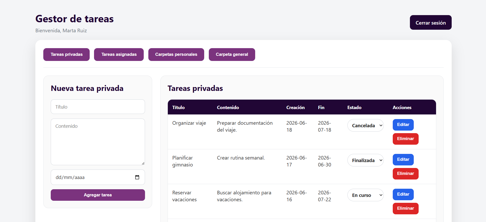
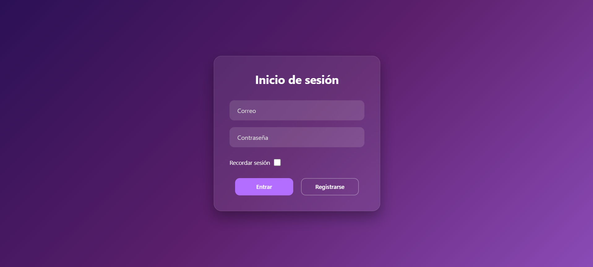
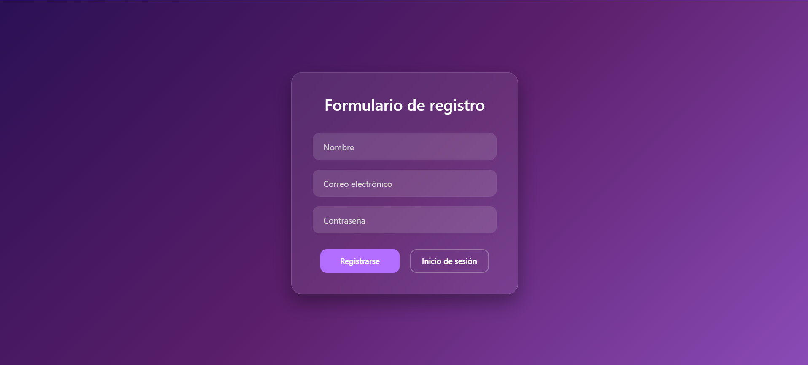
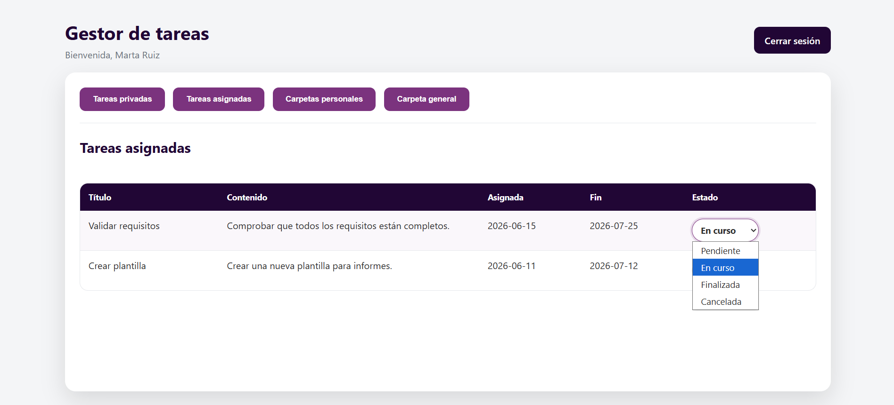
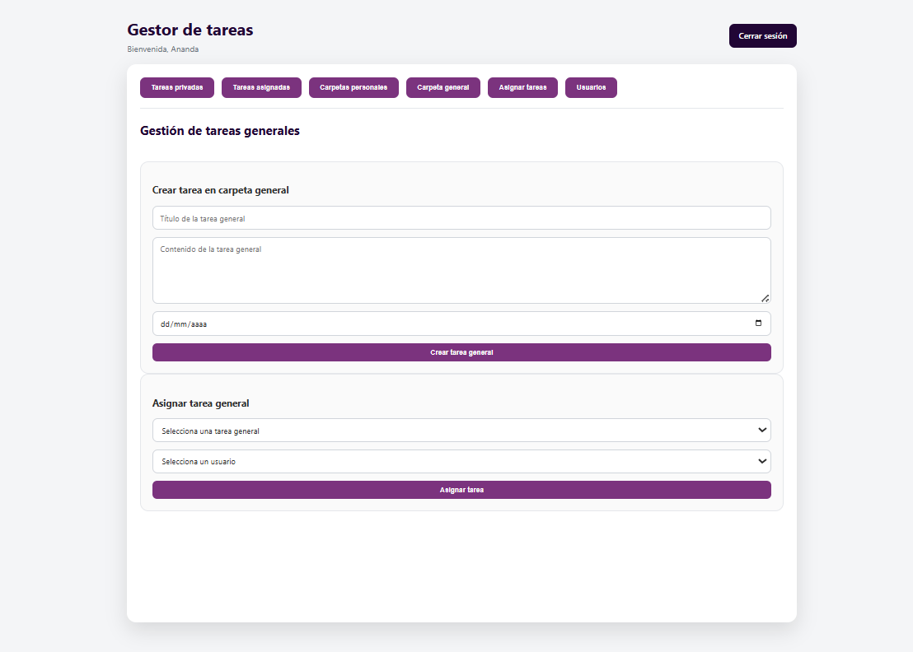
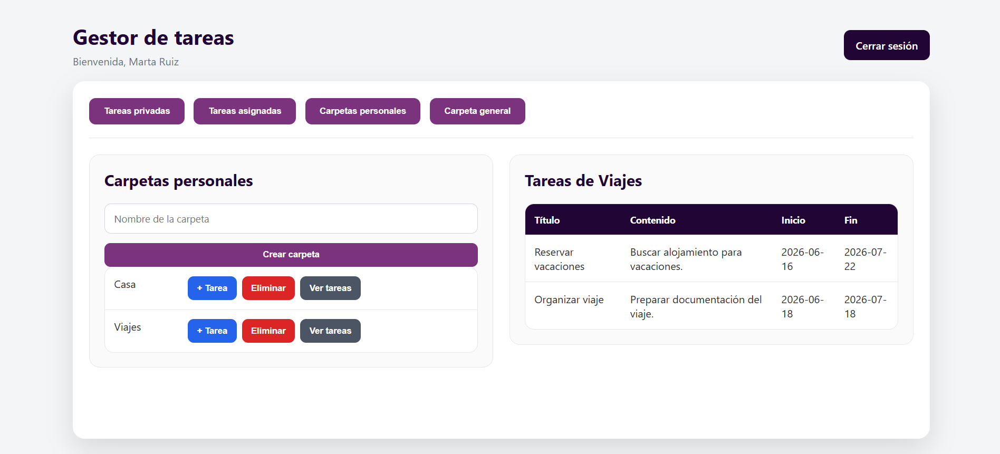
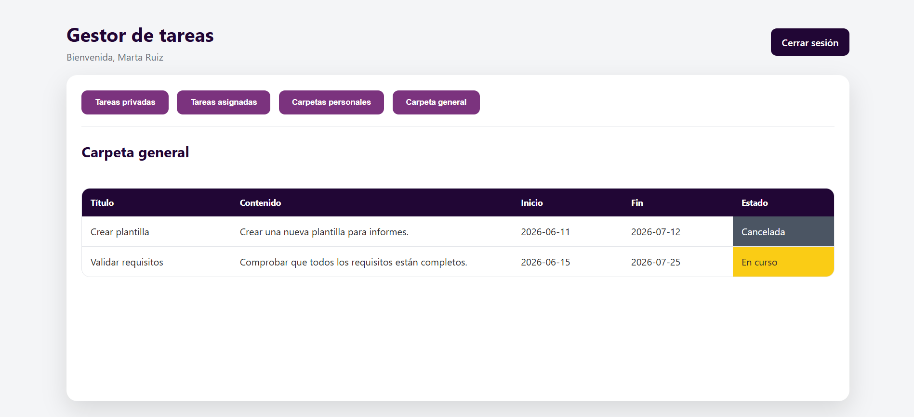
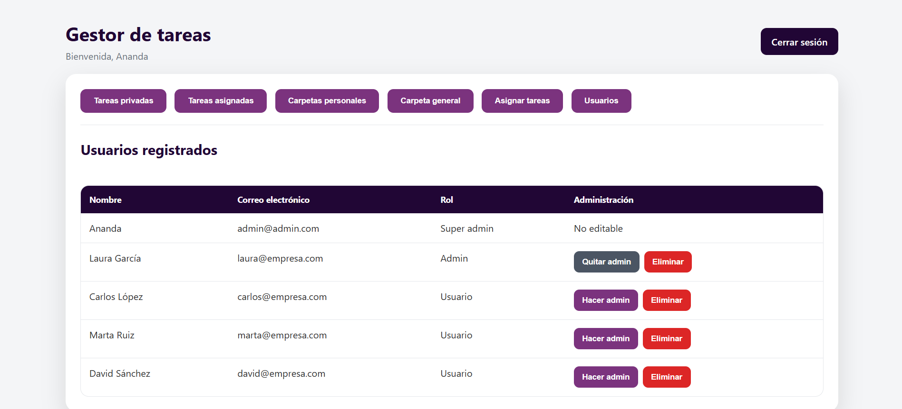
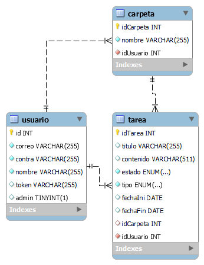

# Gestor de Tareas

Aplicación web desarrollada en **PHP** para la gestión de tareas entre usuarios. Permite crear tareas privadas, organizarlas en carpetas personales y asignar tareas a otros usuarios mediante un sistema de roles (usuario, administrador y superadministrador).



---

## Características

*  Registro e inicio de sesión.
*  Autenticación mediante cookies con token.
*  Gestión completa (CRUD) de tareas privadas.
*  Gestión completa (CRUD) de carpetas personales.
*  Organización de tareas privadas en carpetas.
*  Asignación de tareas a otros usuarios.
*  Carpeta general de tareas para administradores.
*  Estados de las tareas:

  * Pendiente
  * En curso
  * Finalizada
  * Cancelada
*  Gestión de administradores.
*  Eliminación de usuarios por parte del superadministrador.

---

# Capturas de pantalla

## Inicio de sesión



---

## Registro



---

## Tareas asignadas



---

## Crear y asignar tareas
Solo para usuarios admin.



---

## Gestión de carpetas



---

## Carpeta general




---

## Gestión de usuarios
Solo para usuarios admin.



---

# Roles

### Usuario

* Crear tareas privadas.
* Editar y eliminar sus tareas.
* Organizar tareas en carpetas personales.
* Consultar las tareas asignadas.

---

###  Administrador

Todo lo anterior, además de:

* Crear tareas en la carpeta general.
* Asignar tareas generales a usuarios.
* Consultar la carpeta general.

---

### Superadministrador

Todo lo anterior, además de:

* Crear administradores.
* Quitar permisos de administrador.
* Eliminar usuarios del sistema.

---

# Modelo de datos

## Usuario

| Campo  | Tipo    |
| ------ | ------- |
| id     | INT     |
| correo | VARCHAR |
| contra | VARCHAR |
| nombre | VARCHAR |
| token  | VARCHAR |
| admin  | BOOLEAN |

---

## Carpeta

| Campo     | Tipo    |
| --------- | ------- |
| idCarpeta | INT     |
| nombre    | VARCHAR |
| idUsuario | INT     |

---

## Tarea

| Campo     | Tipo                                          |
| --------- | --------------------------------------------- |
| idTarea   | INT                                           |
| titulo    | VARCHAR                                       |
| contenido | VARCHAR                                       |
| estado    | pendiente / en_curso / finalizada / cancelada |
| tipo      | privada / general / asignada                  |
| fechaIni  | DATE                                          |
| fechaFin  | DATE                                          |
| idCarpeta | INT                                           |
| idUsuario | INT                                           |

---

## Modelo Entidad Relación



# Tecnologías

* PHP
* MySQL
* HTML5
* CSS3

---

# Estructura del proyecto

```text
.
├── core/
├── estilos/
├── imagenes/
├── index.php
├── login.php
├── registro.php
├── metodos.php
└── cerrarSesion.php
```

---

# Instalación

## 1. Clonar el repositorio

```bash
git clone https://github.com/usuario/repositorio.git
```

## 2. Crear la base de datos

Importar el archivo SQL incluido en el proyecto.

## 3. Configurar la conexión

Editar:

```text
core/dbconex.php
```

con los datos de tu servidor MySQL.

## 4. Ejecutar el proyecto

Colocar el proyecto en el servidor web (XAMPP, Laragon, WAMP, etc.) y acceder desde el navegador.

---

# Usuario inicial

Correo

```text
admin@admin.com
```

Contraseña

```text
admin
```

---

# Autor

**Ananda M.M**
